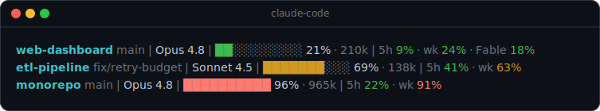
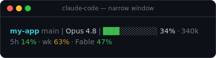
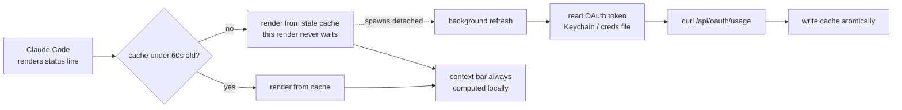

# claude-usage-statusline

A drop-in [status line](https://code.claude.com/docs/en/statusline) for **Claude Code** that shows, on one responsive line, both:

- **how full the current session's context window is**, and
- **your Anthropic plan / rate-limit usage** — the same `5h` / weekly / per-model bars the `/usage` command shows, right in the status line so you never have to run `/usage`.



<sub>Format: `<dir> [branch] | <model> | <context bar> <pct>% · <tokens> | <5h>% · <weekly>% · <per-model>%`. It's a single line for the current session; every bar and percent is color-coded green → yellow → red as it fills.</sub>

**What makes it different:** most Claude Code statusline tools show session *cost*. This is the only one that surfaces the **per-model weekly rate-limit bar** — the temporary promo-model limit (e.g. `Fable`) that's easiest to blow through and hardest to keep an eye on — right next to an honest context-window gauge.

Pure Python 3 standard library plus `curl` — **no pip installs, no dependencies**. It's additive: two files and one settings key. Your other Claude Code settings and hooks are never touched.

**Responsive:** on a narrow terminal the segments flow onto multiple rows instead of truncating; on a wide one it's a single line.



---

## Why

Claude Code already tells you your session cost, but not **how close you are to your plan's rate limits** without stopping to run `/usage`. This keeps the number you actually watch — the weekly bar, and any per-model limit like a promo model — always in view, and adds an honest context-window gauge alongside it.

## The two numbers (they are different)

| Segment | Answers | Source |
| --- | --- | --- |
| **Context bar** (`20% · 200k`) | How full is *this session's* context window right now? | Local session transcript — never hits the network |
| **Plan usage** (`5h` / `wk` / `<Model>`) | How much of your *account's* 5-hour + weekly quota is used? | Anthropic account usage endpoint (cached) |

A red context bar means *this conversation* is nearly full (compaction is near) — it says nothing about your plan. A red `wk` means your **weekly plan limit** is nearly spent. Don't conflate them.

---

## Install

```bash
git clone https://github.com/hjl1045/claude-usage-statusline.git
cd claude-usage-statusline
./install.sh
```

`install.sh` copies `statusline.py` into your Claude config dir and sets **only** the `statusLine` key in `settings.json` (backing the file up first). Start a new Claude Code session to see it.

<details>
<summary>Manual install (no script)</summary>

1. Copy the script into your config dir:
   ```bash
   cp statusline.py ~/.claude/statusline.py
   ```
2. Add this to the top-level object in `~/.claude/settings.json`:
   ```json
   "statusLine": {
     "type": "command",
     "command": "python3 $HOME/.claude/statusline.py",
     "padding": 0
   }
   ```
Using `$HOME` (not a hardcoded path) keeps the one snippet working on macOS and Linux.
</details>

**Update later:** `git pull && ./install.sh`.

## Requirements

- `python3` and `curl` (both preinstalled on macOS and most Linux).
- You must be **logged into Claude Code** on the machine — the script reads your OAuth token automatically (macOS Keychain, or `~/.claude/.credentials.json` on Linux / cloud boxes).
- Claude Code **≥ v2.1.153** for responsive wrapping; older versions just render one line.
- The context bar and plan bars share the terminal, so a Nerd Font gives you the branch glyph — without one it falls back to plain text.

---

## How it works

The status line re-renders many times a second, so it **must never block on the network**. It reads the plan usage from a short-lived on-disk cache and refreshes that cache in a detached background process:



- **Context bar** is computed purely from the local session transcript (the most recent main-thread assistant turn's token usage ÷ the context window). The window size is resolved with a self-correcting heuristic, so the bar stays honest across new models and 1M-context variants without edits.
- **Plan usage** parses the `limits[]` array from the account usage endpoint: `session` (5h), `weekly_all` (wk), and any `weekly_scoped` per-model limit, which is labelled by its own display name and appears **only while it exists** (so a temporary promo model shows up and disappears on its own).
- **Fail-soft:** any timeout, missing token, or endpoint change just drops the plan-usage segment — the context bar keeps working.

## Configuration

Two optional environment variables:

| Variable | Effect |
| --- | --- |
| `CLAUDE_CONFIG_DIR` | Use a config dir other than `~/.claude` (matches Claude Code's own variable). |
| `CLAUDE_STATUSLINE_USAGE=0` | Turn off the network plan-usage segment entirely — offline, privacy, or CI. The context bar still renders. |

Colors and thresholds (green < 50%, yellow < 80%, red ≥ 80%) live near the top of `statusline.py` if you want to tweak them.

## Per-environment notes

- **macOS:** the very first render may pop a Keychain prompt for the token → click **Always Allow**.
- **Linux / SSH cloud box:** the status line runs on *that* host, so install it there and run `claude` login so `~/.claude/.credentials.json` exists.
- **Anthropic-hosted cloud agents:** custom status lines aren't supported there — nothing to install.

## Troubleshooting

- **No plan-usage segment appears.** You're likely not logged in, the token expired (it refreshes on normal Claude Code use — the next render picks it up), or the endpoint changed. Run the check below.
- **Context bar seems stuck.** It reflects the *last completed* assistant turn, so it updates one beat behind — that's expected, not a bug.
- **Verify the data source directly** (prints only percentages + reset times, no secrets):
  ```bash
  tok=$(security find-generic-password -s "Claude Code-credentials" -w | python3 -c 'import json,sys;print(json.load(sys.stdin)["claudeAiOauth"]["accessToken"])')  # macOS
  # Linux: tok=$(python3 -c 'import json;print(json.load(open("'$HOME'/.claude/.credentials.json"))["claudeAiOauth"]["accessToken"])')
  curl -s https://api.anthropic.com/api/oauth/usage \
    -H "Authorization: Bearer $tok" \
    -H "anthropic-beta: oauth-2025-04-20" \
    -H "Content-Type: application/json" | python3 -m json.tool
  ```

## ⚠️ About the usage endpoint

The plan-usage numbers come from `GET https://api.anthropic.com/api/oauth/usage` — the **same undocumented endpoint the `/usage` command uses**. This is **unofficial**:

- It's read-only, uses **your own** OAuth token, and reports **your own** account usage.
- It is **not a supported API** and can change or disappear with any Claude Code update. If it does, this tool degrades gracefully — the plan-usage segment drops and the context bar keeps working.

If you're not comfortable with that, set `CLAUDE_STATUSLINE_USAGE=0` and enjoy just the context bar.

## Contributing

Small, focused PRs welcome — new per-model buckets, other platforms, format tweaks. The whole thing is one dependency-free `statusline.py`; keep it that way and keep it fail-soft.

## License

[MIT](./LICENSE)
